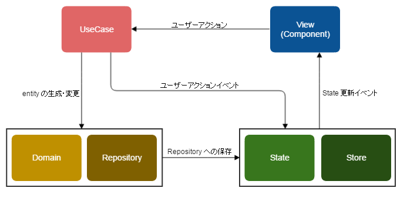

# データの流れ
## 概略図

## アプリの初期化フロー

以下は大まかなAppの初期化から表示の更新におけるフローです。

1. Initialize domain(ドメインの初期化、Repositoryへの保存、データベースの初期化)
1. AppContainer(Rootとなるコンポーネント) Mount
1. 初期表示
1. Routing(Routerコンポーネントでのルーティング)
    1. Update State 
    1. Update View

これ以降は、[use-case](./use-case.md)を使い、[domain](./domain.md)や[store](./store.md)を更新する。
AppContainerはstoreの変更を監視しているため、stateが変更される度にViewを更新するのが基本的な表示の更新フローです。

## 更新のパターン
### 永続化するパターン
View -> UseCase -> Domain -> Repository -> State -> View -> ...

### Stateを直接更新するパターン
View -> UseCase -> State -> View -> ...

Stateのみに存在する情報を更新したいときに、`dispatch`による更新を行う。
## 各クラスの概要
### View(Component)
ユーザーアクションやポーリングなどによりUseCaseを生成し実行する。  
UseCase実行時に必要なデータを渡す。

Component内にも役割の階層があるため、詳細は[Component](./component.md)を参照。

### UseCase
受け取ったデータを用いて、entityの生成、変更を行い、結果をRepositoryに保存する。  
もしくは、受け取ったデータを必要に応じて加工し、Stateへ向けたイベントを発する。

### Domain
生成されたり、変更される対象。  
扱われるデータのひとつなので、Domainが他クラスにデータを渡すことはない。

### Repository
永続化周りの処理を担当。  
データの保存が行われた際に、Stateへ向けたイベントを発する。

### State
生成されたり、変更される対象。  
Viewを意識したデータを持ち、UseCaseのイベントの処理を行う。

### Store
UseCaseとRepositoryのイベントを監視し、Stateの生成、変更を行う。  
Stateの更新がある場合は、Viewに向けたイベントを発する。

# 実装フロー例

## ボタンを追加したい
※ この順で実装すべきというものではなく、あくまで参考です。

### Component の用意

- component/project下にHogeButton.jsを追加する。  
- component/container下から、HogeButtonを利用したいcontainerを選び、HogeButton利用する。  

詳細は [ComponentのREADME](./component.md) を参照して下さい。

### UseCase の追加や利用
すでにHogeButtonを利用した際のUseCaseがある場合は、container内でHogeButtonのハンドラを定義し、HogeButtonへ渡す。
※ project下ではUseCaseに依存させないため、containerでハンドラを定義する。

UseCaseがない場合は新規に作成し、それを利用する。
(詳細は [UseCase の README](./use-case.md) を参照して下さい。)

### Domain の関数/プロパティの追加や変更
既存の関数で要件が満たせない場合は、関数の追加や変更を行う。  
また、新規プロパティが必要な場合は追加を行う。
(詳細は [Domain の README](./domain.md) を参照して下さい。)

### State の変更
Domainの変更を受けてStateのプロパティの変更、getter関数を修正したりする。
(詳細は [State の README](./store.md) を参照して下さい。)

### Component の変更
Stateの変更により、表示内容に変更がある場合は、propsの追加や処理の変更を行う。

